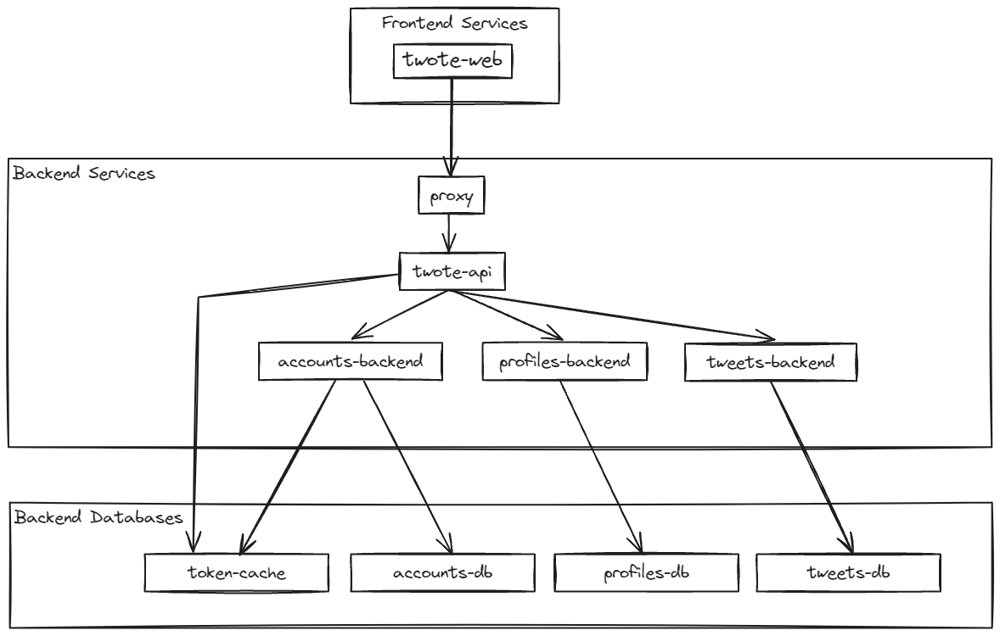

# Twote

[One Pager](https://docs.google.com/document/d/14h-WVhfJx1pfHTL0zWkMsaf66OjMi0LC3AF4IJZPIiI/edit)

A social media app where users can post messages and follow other users.




## Local Setup

See [SETUP.md](documentation/SETUP.md) for instructions on how to set up the project on your local machine.

## Running the app

The application runs within Docker. Start it with this command:

```
./scripts/bootstrap_docker.sh
```

For windows, use this command:

```
./scripts/windows/bootstrap_docker.ps1
```


Next, open http://localhost:3000/ in your browser.