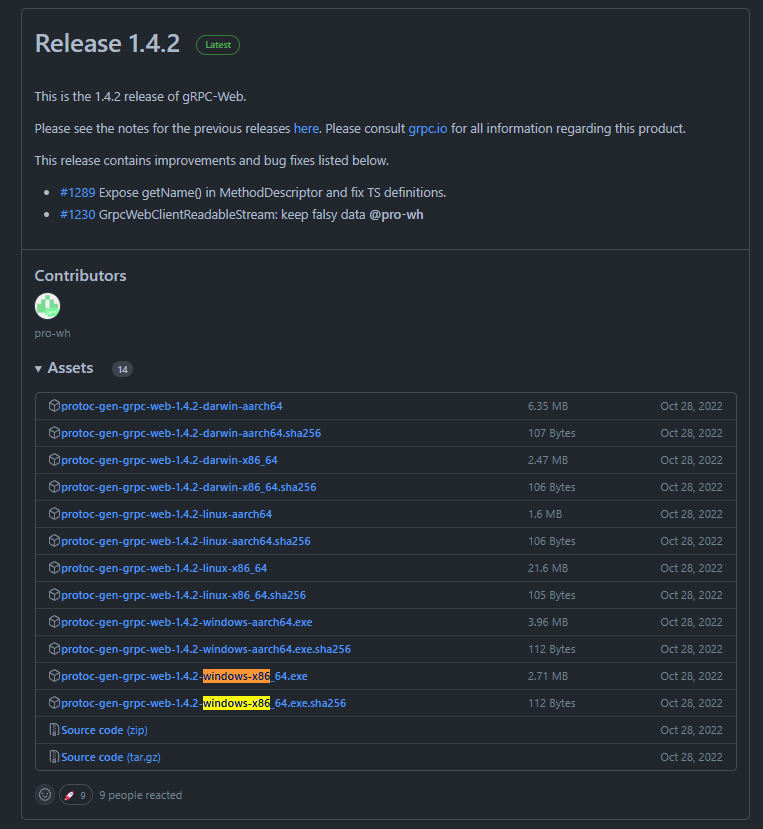
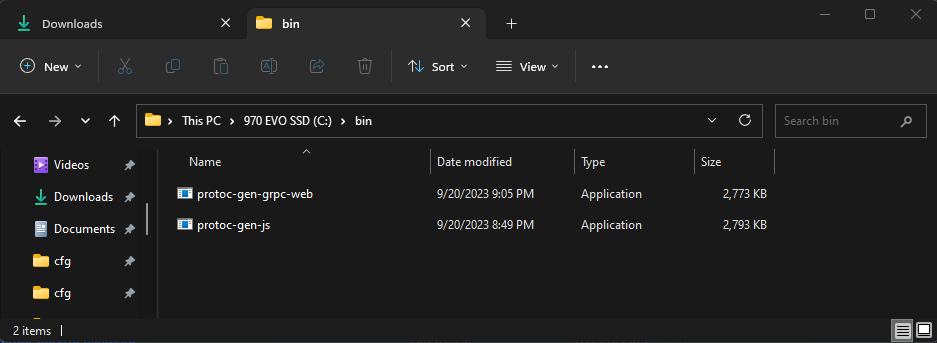
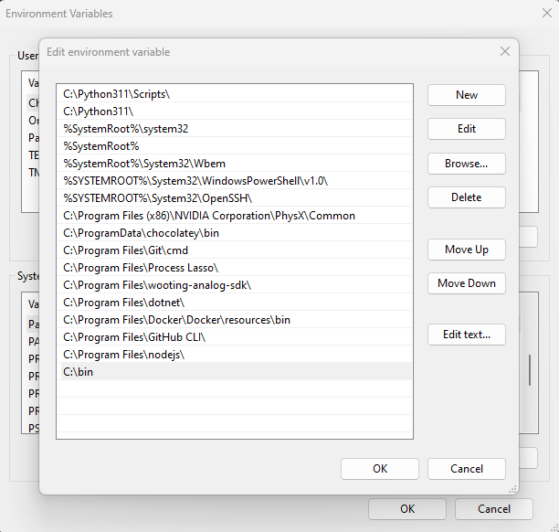

Follow these instructions to set up the project on your local machine. You will install dependencies & compile `.proto`
files so they can be indexed by your IDE.

## 0: Prelude: Downloading binaries to Windows

If there is no fancy installation method & you can only download a binary, download your binaries & move them into a path like `C:\bin`.

Then add `C:\bin` to your path 

Apply your new settings & reload your terminal with `. $PROFILE` (or completely restart your terminal)

| Releases | `C:\bin`                | System Path Variable     |
|----------|---------------------|--------------------------|
|          |  |   |


## 1: Install protocol buffers

Ensure you have `protoc` installed:

1. https://grpc.io/docs/protoc-installation/

Ensure you have `protoc-gen-grpc-web` installed:

1. https://github.com/grpc/grpc-web/releases

Ensure you have `protoc-gen-js` installed:

1. https://github.com/protocolbuffers/protobuf-javascript/releases

## 2: Install the Rust toolchain

Follow https://www.rust-lang.org/tools/install to install the Rust toolchain.

This will install `rustc` (the Rust compiler), `cargo` (the Rust package manager), and `rustup` (the Rust toolchain
manager).

## 3: Install npm (a Javascript package manager)

Follow https://docs.npmjs.com/downloading-and-installing-node-js-and-npm to install `npm`.

After installing `npm`, run `npm install`. This will install of the project's Javascript dependencies.

## 4: compile the proto files

Generate the Javascript code from the proto files:

```
chmod +x ./scripts/proto.sh && ./scripts/proto.sh
```

Generate the Rust code from the proto files:

```
cargo build
```

## 5: Install Docker

Ensure you have `docker` and `docker-compose` installed.

1. https://docs.docker.com/get-docker/
2. https://docs.docker.com/compose/install/

## 6: Choose your IDE

There are three primary IDEs for Rust development:
1. [IntelliJ + Rust](https://intellij-rust.github.io/)
2. [RustRover](https://www.jetbrains.com/rust/)
3. [VSCode + Rust Analyzer](https://rust-analyzer.github.io/)

I personally use IntelliJ + Rust.

Once your IDE is installed, simply open the root directory of the project in your IDE.

## 7: Run the server

See [README.md](README.md#running-the-app) for instructions on how to run the server.